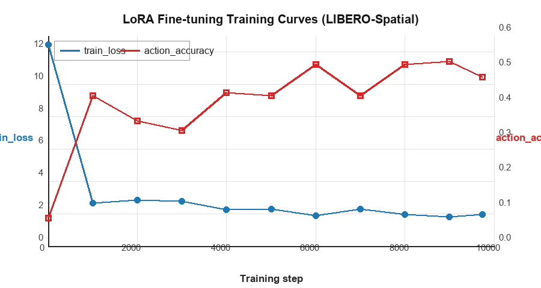
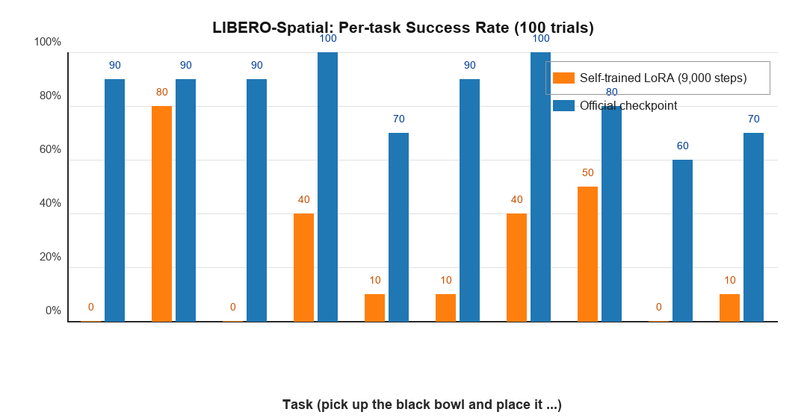

# OpenVLA (Vision-Language-Action) 模型复现报告

> **论文**: [OpenVLA: An Open-Source Vision-Language-Action Model](https://arxiv.org/abs/2406.09246)（arXiv:2406.09246v3）
> **作者**: Moo Jin Kim, Karl Pertsch, Siddharth Karamcheti, et al.（Stanford University, UC Berkeley, Toyota Research Institute, Google DeepMind, Physical Intelligence, MIT）
> **代码仓库**: [github.com/openvla/openvla](https://github.com/openvla/openvla)（官方）；本次复现代码见第 7.3 节

---

## 目录

1. [论文背景与核心贡献](#1-论文背景与核心贡献)
2. [OpenVLA 模型原理](#2-openvla-模型原理)
3. [实验设置](#3-实验设置)
4. [实验结果](#4-实验结果)
5. [结果分析与讨论](#5-结果分析与讨论)
6. [复现过程遇到的问题](#6-复现过程遇到的问题)
7. [结论与展望](#7-结论与展望)

---

## 1. 论文背景与核心贡献

### 1.1 问题动机

在 OpenVLA 提出之前，机器人操作策略的主流做法仍是"一个任务训练一个模型"，这类策略往往只能适应训练分布内的环境变化（物体位置、光照等），面对新物体、新场景和新指令时泛化能力不足。

另一方面，视觉-语言基础模型（如 SigLIP、DINOv2、Llama 2）已在跨模态理解和指令泛化上展现出很强的能力，但机器人领域缺少同等量级的开源基础模型：当时最强的通用操作模型 RT-2-X（55B 参数）**闭源**，无法复现、难以微调；同时全量微调动辄需要多张 A100 级 GPU，消费级硬件难以承担。

**核心问题**：能否构建一个**开源、通用、可高效微调**的视觉-语言-动作（VLA）基础模型，在保持高性能的同时让研究者能用单张消费级 GPU（如 RTX 4090）完成适配？

### 1.2 核心贡献

1. **开源 7B 参数 VLA 基础模型**：在 Open X-Embodiment 数据集的 970k 条真实机器人演示上训练，同时开源模型权重、训练代码与数据管线。
2. **强视觉-语言骨干**：基于 Prismatic VLM，融合 DINOv2（低层空间信息）与 SigLIP（高层语义）双视觉编码器 + Llama 2 7B 语言模型，并以动作 token 化方式输出 7-DoF 连续动作。
3. **超越闭源模型**：在 29 个任务、多种机器人平台上平均成功率比 RT-2-X（55B）高 16.5%（绝对值），参数量仅为后者的约 1/7。
4. **参数高效微调**：系统对比全量微调与多种高效微调方法，证明 LoRA 仅训练约 1.4% 参数即可匹配全量微调性能，使消费级 GPU 上的微调与复现成为可能。
5. **完整可复现生态**：提供官方 checkpoint、微调脚本与 LIBERO 等仿真基准的复现流程。

### 1.3 论文主要结论

| 发现 | 说明 |
|------|------|
| 通用 VLA 策略可行 | 970k 演示、多机器人平台上训练的 7B 模型，平均表现超越闭源 RT-2-X |
| LoRA 高效微调 | 只训练 1.4% 参数即可匹配全量微调，默认推荐 rank=32；单张 A100 上 10–15 小时可完成新任务适配 |
| 动作 token 化 | 每维动作离散为 256 个 bin，覆盖 Llama tokenizer 中最少使用的 256 个 token，训练目标为标准 next-token prediction（仅对动作 token 计算损失） |
| 多轮训练有效 | 训练 27 个 epoch，动作 token 准确率持续提升至 95% 以上，真实机器人表现才趋于收敛 |
| 推理开销可控 | bf16 下约 15GB 显存，RTX 4090 上约 6Hz，可在单卡消费级 GPU 上部署 |

---

## 2. OpenVLA 模型原理

### 2.1 整体架构

OpenVLA 将机器人控制建模为"视觉 + 语言 → 动作 token 序列"的序列生成问题：

```
输入图像 (256 × 256) + 语言指令
    ↓
视觉编码器（DINOv2 + SigLIP 双塔，特征通道级拼接，约 600M 参数）
    ↓
2 层 MLP 投影器（映射到 LLM 隐藏维度）
    ↓
Llama 2 7B 语言模型（文本 token + 视觉 token 拼接输入）
    ↓
动作 token 序列（7-DoF × 256 bins 离散动作）
    ↓
反离散化（de-tokenizer）→ 连续 7-DoF 机器人动作
```

模型输入为一张第三人称相机图像（LIBERO 数据为 256×256）与自然语言指令，输出末端执行器的 7 维相对动作（位置增量 Δx/Δy/Δz、姿态变化 Δθ、夹爪开合）。

### 2.2 视觉编码与投影

OpenVLA 采用 Prismatic-7B VLM 作为骨干。视觉编码器由**两个预训练模型组成**：

- **SigLIP**：提供高层语义特征；
- **DINOv2**：提供低层空间/几何特征，对机器人精细操作中的空间推理尤为重要。

输入图像按 patch 分别经过两个编码器，所得特征**按通道拼接**，再经一个小型 **2 层 MLP 投影器**映射到 Llama 2 的隐藏维度，与指令文本的 token 序列一起送入 LLM。

### 2.3 动作表征与 token 化

连续动作无法直接被 LLM 输出，OpenVLA 采用 RT-2 风格的动作 token 化：

1. 对每个动作维度，取训练数据中该维动作的 **1st–99th 分位数**区间并均匀划分为 **256 个 bin**（相比 min-max 划分更能抵抗离群点）；
2. 将 7 个维度映射为 7 个整数 ∈ [0, 255]；
3. 覆盖 Llama tokenizer 词汇表中**最少使用的 256 个 token** 作为动作 token（原始词汇表只预留 100 个特殊 token，不足以覆盖 7×256）；
4. 训练时对动作 token 序列做 next-token prediction，交叉熵损失**只计算动作 token**；推理时对输出的动作 token 反离散化得到连续动作。

### 2.4 预训练设置

| 项目 | 配置 |
|---|---|
| 训练数据 | Open X-Embodiment，970k 条真实机器人演示 |
| 训练算力 | 64 × A100 GPU，约 14 天（合计 21,500 A100-hours） |
| Batch size | 2,048 |
| 学习率 | 固定 2e-5（不做 warmup） |
| 训练轮数 | 27 epochs（动作 token 准确率 >95% 后收敛） |
| 损失 | next-token prediction，仅在动作 token 上计算交叉熵 |

### 2.5 模型规格

| 组件 | 配置 |
|---|---|
| 视觉编码器 | SigLIP + DINOv2（合计约 600M 参数） |
| 投影器 | 2 层 MLP |
| 语言骨干 | Llama 2 7B |
| 总参数量 | 约 7B（本复现实测 7.54B） |
| 动作空间 | 7-DoF，每维 256 bins |
| 输入分辨率 | 256×256（LIBERO 数据为官方重新渲染） |
| 推理显存（bf16） | 约 15GB |
| LoRA 微调可训练参数 | 110,828,288（约占总参数 1.45%，rank=32） |

---

## 3. 实验设置

### 3.1 软硬件环境

| 配置项 | 规格 |
|--------|------|
| GPU | NVIDIA RTX 4090 D（24GB GDDR6X） |
| 云平台 | Seetacloud（AutoDL） |
| CUDA | 12.1 |
| Python | 3.10.20（conda 环境 openvla） |
| PyTorch / torchvision | 2.2.0+cu121 / 0.17.0+cu121 |
| Transformers / timm / tokenizers | 4.40.1 / 0.9.10 / 0.19.1（官方钉死版本） |
| numpy / tensorflow / tensorflow_datasets | 1.26.4 / 2.15.0 / 4.9.3 |
| protobuf | 6.31.1（兼容 tensorflow_metadata 修复） |
| robosuite / mujoco / gym | 1.4.1 / 2.3.7 / 0.26.2 |
| 代码 | openvla/openvla（main，commit c8f03f4）、Lifelong-Robot-Learning/LIBERO |

### 3.2 预训练权重与官方 checkpoint

| 权重 | 大小 | 用途 |
|------|------|------|
| `openvla-7b` | 15GB | 预训练基础模型，LoRA 微调起点 |
| `openvla-7b-finetuned-libero-spatial` | 15GB | 官方在 LIBERO-Spatial 上 LoRA 微调的 checkpoint（论文 Table 12 对应产物） |

> 论文附录 E 明确说明 LIBERO 实验的 OpenVLA 采用 **LoRA（r=32）** 微调（"fine-tuned ... via LoRA (r=32)，as described in Section 5.3"），因此官方 LIBERO checkpoint 本身就是 LoRA 微调产物。

### 3.3 数据集

LIBERO 基准包含四个任务套件（Spatial / Object / Goal / Long），每套件含 10 个任务 × 50 条人工遥操作演示。官方将演示重新渲染为 256×256 分辨率（原始 LIBERO 为 128×128，直接上采样会损失图像质量）。本复现聚焦 **LIBERO-Spatial**：

| 项目 | 说明 |
|------|------|
| 数据集 | `modified_libero_rlds` 中的 `libero_spatial_no_noops` |
| 训练样本 | 432 episodes（10 任务 × 50 演示，去除 no-op 后） |
| 任务内容 | "pick up the black bowl and place it ..." 系列空间关系任务 |
| 评估协议（官方 checkpoint） | seed=7、`center_crop=True`、10 任务 × 10 rollout = 100 trials |
| 论文评估协议 | 3 seeds × 500 trials（本复现为单 seed 小规模） |

### 3.4 微调超参数（LoRA）

本次自训微调参数与官方 LoRA 配方保持一致，**仅训练步数大幅缩减**：

| 超参数 | 本次实验 | 官方配方（LIBERO-Spatial） |
|---|---|---|
| LoRA rank / alpha / dropout | 32 / 16 / 0.0 | 32 / 16 / 0.0 |
| 学习率 | 5e-4 | 5e-4 |
| 有效 batch size | 16（batch=2 × grad_accum=8） | 16 |
| 图像增强 image_aug | True | True |
| 训练步数 | 10,000（实际跑到 9,766） | **200,000** |
| 可训练参数量 | 110,828,288（占 7.65B 的 1.45%） | 相同结构 |
| 优化器 / 调度 | AdamW / cosine | 官方默认 |

> 显存方面：batch=4 在 24GB 卡上 OOM，改为 batch=2 + 梯度累积 8 后稳定运行，有效 batch 与官方一致（16）。

### 3.5 数据增强与输入预处理

- 训练：开启 `image_aug`（随机裁剪等）；评估：`center_crop=True`，与官方评估协议一致。
- Prompt 格式：官方 `In: What action should the robot take to {task}?\nOut:`，训练与评估严格一致。
- 推理：bf16 单卡加载；仿真评估使用 `MUJOCO_GL=egl` 离屏渲染。

---

## 4. 实验结果

### 4.1 推理基准（bf16，单卡 RTX 4090）

使用随机 256×256 图像 + 指令调用 `predict_action`（30 次，含 3 次 warmup）：

| 指标 | 复现值 | 论文报告 |
|---|---|---|
| 推理频率 | **5.97 Hz**（167.6 ms/次） | ~6 Hz（RTX 4090） |
| 显存占用 | **15.47 GB** | ~15 GB（bf16） |
| 参数量 | 7.54B | 7B |

样例动作输出（7-DoF，非归一化）：`[-0.0029, 0.0407, -0.0052, 0.0133, -0.0035, 0.0854, 0.0]`

结论：与论文 Figure 6 中 RTX 4090 数据点高度一致。

### 4.2 官方 checkpoint：LIBERO-Spatial 仿真评估

- Checkpoint：`openvla-7b-finetuned-libero-spatial`（官方 LoRA r=32 微调）
- 协议：seed=7、`center_crop=True`、10 任务 × 10 rollout = 100 trials
- 渲染：`MUJOCO_GL=egl` 离屏渲染

| # | 任务（pick up the black bowl ... place it ...） | 成功率 |
|---|---|---|
| 1 | between the plate and the ramekin ... on the plate | 90% |
| 2 | next to the ramekin ... on the plate | 90% |
| 3 | from table center ... on the plate | 90% |
| 4 | on the cookie box ... on the plate | 100% |
| 5 | in the top drawer of the wooden cabinet ... | 70% |
| 6 | on the ramekin ... on the plate | 90% |
| 7 | next to the cookie box ... on the plate | 100% |
| 8 | on the stove ... on the plate | 80% |
| 9 | next to the plate ... on the plate | 60% |
| 10 | on the wooden cabinet ... on the plate | 70% |
| **总计** | **84 / 100 = 84.0%** | 论文：**84.7 ± 0.9%** |

结论：100 次 rollout 成功率 84.0%，与论文 Table 12 的 84.7% 基本一致（84/100 的 95% Wilson 置信区间约为 [75.6%, 89.9%]，包含论文值），**官方 checkpoint 复现成功**。

### 4.3 LoRA 微调训练过程

- 启动：2026-08-12 22:41；因关闭 GPU 中断：2026-08-13 约 07:00。
- 实际完成 **9,766 / 10,000 步**，累计约 **8.3 小时**，步速约 **2.6–3.0 秒/步**（含 checkpoint 保存开销）。
- 每 1,000 步保存一次完整合并模型，最后可用的 checkpoint 为**第 9,000 步**。
- 训练指标来自 wandb 离线数据完整解析，关键节点如下：

| 步数 | train_loss | action_accuracy | l1_loss |
|---|---|---|---|
| 0 | 12.478 | 0.080 | 0.463 |
| 1,000 | 2.652 | 0.429 | 0.145 |
| 2,000 | 2.823 | 0.357 | 0.123 |
| 3,000 | 2.777 | 0.330 | 0.136 |
| 4,000 | 2.239 | 0.438 | 0.087 |
| 5,000 | 2.284 | 0.429 | 0.100 |
| 6,000 | 1.894 | 0.518 | 0.068 |
| 7,000 | 2.285 | 0.429 | 0.097 |
| 8,000 | 1.963 | 0.518 | 0.060 |
| 9,000 | 1.800 | 0.527 | 0.063 |
| 9,740（最后记录） | 1.967 | 0.482 | 0.077 |



**图 1**：LoRA 微调训练曲线。loss 从 12.48 降至约 1.8–2.0，动作 token 准确率从 8% 升至约 52%，L1 动作损失从 0.46 降至约 0.06–0.08。训练链路正常收敛，优化器确实在拟合训练分布。

### 4.4 自训 LoRA 评估与对比

评估协议与官方 checkpoint 复现完全一致（seed=7、`center_crop=True`、100 trials）：

| 模型 | 成功率（100 trials） | 说明 |
|---|---|---|
| 自训 LoRA（9,000 步合并模型） | **24 / 100 = 24.0%** | 本次微调产物 |
| 官方微调 checkpoint（同协议复现） | **84 / 100 = 84.0%** | 4.2 节 |
| 论文 Table 12 | 84.7 ± 0.9% | 3 seeds × 500 trials |

分任务成功率对比（自训 vs 官方微调 checkpoint 复现）：

| 任务（pick up the black bowl ... place it ...） | 自训 | 官方 |
|---|---|---|
| between the plate and the ramekin | 0% | 90% |
| next to the ramekin | 80% | 90% |
| from table center | 0% | 90% |
| on the cookie box | 40% | 100% |
| in the top drawer of the wooden cabinet | 10% | 70% |
| on the ramekin | 10% | 90% |
| next to the cookie box | 40% | 100% |
| on the stove | 50% | 80% |
| next to the plate | 0% | 60% |
| on the wooden cabinet | 10% | 70% |



**图 2**：LIBERO-Spatial 分任务成功率对比（100 trials）。

### 4.5 与论文对比汇总

| 指标 | 论文报告 | 本复现 | 一致性 |
|---|---|---|---|
| 推理频率（bf16, 4090） | ~6 Hz | 5.97 Hz | 一致 |
| 推理显存（bf16） | ~15 GB | 15.47 GB | 一致 |
| 参数量 | 7B | 7.54B | 一致 |
| LIBERO-Spatial（官方 checkpoint） | 84.7 ± 0.9% | 84.0%（100 trials） | 基本一致 |
| LIBERO-Spatial（自训 9,766 步） | — | 24.0% | 未达标（训练步数不足，见第 5 节） |

---

## 5. 结果分析与讨论

### 5.1 官方 checkpoint 复现结论

推理基准与 LIBERO-Spatial 评估两项结果均与论文一致，说明官方 checkpoint 的**推理链路、评估协议与仿真环境复现是成功的**；84.0% 与 84.7% 的差距在 100 trials 的统计波动范围内（95% Wilson 置信区间 [75.6%, 89.9%]）。

### 5.2 自训微调未达标：训练步数严重不足

- 官方微调 LIBERO-Spatial 的配方为 **200,000 步**（官方 `finetune.py` 默认 `max_steps=200_000`；社区在 24GB 卡上的复现同样为 200k 步 / 约 80 小时）。
- 本次实际只跑了 **9,766 步，约为官方配方的 4.9%**。即使训练指标已明显下降，模型仍未在闭环 rollout 中形成足够的任务泛化能力。
- 按当前步速（约 2.8 s/步）跑满官方 200k 步，单张 RTX 4090 预计需要**约 6.5 天**连续 GPU 时长；本次约 8.3 小时仅相当于其 5%。

### 5.3 动作预测对比

同一真实 LIBERO 场景（任务 0 初始状态）下三个模型的 7-DoF 动作预测（非归一化）：

| 模型 | 预测动作 |
|---|---|
| 基础模型 openvla-7b（未微调） | [0.0005, -0.0001, 0.0026, -0.0052, 0.0186, -0.0017, 0.9961] |
| 自训 LoRA（9,000 步） | [-0.0030, -0.0014, -0.0027, 0.0000, 0.0000, 0.0001, 0.9961] |
| 官方微调 checkpoint | [0.6240, 0.4749, 0.3639, 0.0000, 0.1098, 0.0001, 0.9961] |

自训模型在该场景下输出的动作与基础模型一样接近"原地不动"（仅有夹爪闭合），而官方微调模型给出了明确的抓取-移动动作。这解释了 rollout 成功率偏低：策略在训练分布之外的初始场景上退化为近似无动作策略。

### 5.4 分任务差异

自训模型并非完全没学到东西：部分任务成功率可达 40%–80%（如 "next to the ramekin" 80%、"on the stove" 50%），说明已学到部分场景下的行为，但整体远未收敛；官方模型各任务成功率为 60%–100%。

### 5.5 评估协议差异说明

本复现为单 seed × 100 trials，论文为 3 seeds × 500 trials。小规模评估下随机波动更大，但官方 checkpoint 复现 84.0% 与论文 84.7% 的差距仍在统计误差内；自训模型 24.0% 与 84.7% 的巨大差距则远超统计波动，结论稳健。

---

## 6. 复现过程遇到的问题

### 6.1 环境与依赖问题

| # | 问题 | 处理 |
|---|---|---|
| 1 | 微调版 checkpoint 的 `config.json` 等文件 `auto_map` 带 `openvla/openvla-7b--` 前缀，本地加载会去 HuggingFace 拉自定义代码 | 剥离前缀 |
| 2 | 微调版 checkpoint 缺少自定义代码文件（`configuration_prismatic.py`、`modeling_prismatic.py`、`processing_prismatic.py`） | 从基础 checkpoint 复制补齐 |
| 3 | robosuite 1.4.1 与 mujoco 3.x 不兼容（`MjData.qM` API 移除） | 降级 mujoco 2.3.7 |
| 4 | 无显示服务器，仿真渲染失败 | 安装 `libegl1`、`libosmesa6`，设置 `MUJOCO_GL=egl` 离屏渲染 |
| 5 | 未安装 flash-attn，官方评估脚本指定 `flash_attention_2` | 改为默认注意力实现（推理速度 5.97Hz 仍达标） |
| 6 | tensorflow_metadata 1.21 与 protobuf 版本冲突（`runtime_version` 错误） | protobuf 升级到 6.31.1（TF 2.15 仍正常） |

### 6.2 显存优化（LoRA 微调）

RTX 4090 24GB 上的显存管理：

| 配置 | 显存情况 | 备注 |
|---|---|---|
| batch=4 | 24GB 卡 OOM | ❌ 不可用 |
| batch=2 + grad_accum=8 | 稳定运行 | ✅ 有效 batch=16，与官方一致 |

### 6.3 训练中断与 checkpoint

- 训练于 2026-08-13 约 07:00 因关闭 GPU 被中断，实际完成 9,766/10,000 步。
- 训练每 1,000 步保存一次合并模型，中断后最后一个可用 checkpoint 为第 9,000 步；自训评估使用该 checkpoint。
- 评估已确认加载的是 9,000 步自训模型（非官方模型），且与官方模型复现使用完全相同的协议，排除评估差异。

### 6.4 训练链路验证

为排除代码/环境问题，用诊断脚本从基础模型重新运行 500 步，复现了相同的初始收敛趋势（loss 12.5 → 约 3.2，acc 0.08 → 约 0.30），证明数据管线、prompt 格式、梯度流与评估链路均无 bug，自训未达标的原因是训练量不足而非实现错误。

---

## 7. 结论与展望

### 7.1 主要结论

1. **官方 checkpoint 复现成功**：推理频率 5.97 Hz、显存 15.47 GB 与论文一致；LIBERO-Spatial 评估 84.0%（100 trials）与论文 84.7 ± 0.9% 在统计误差内一致。
2. **自训 LoRA 微调未达标**：9,000 步 checkpoint 仅 24.0%，远低于官方 checkpoint（84.0%）与论文（84.7%）。
3. **失败根因明确**：训练步数不足（9,766 步 ≈ 官方 200k 配方的 5%），模型尚未收敛到可闭环泛化的策略；已排除数据、prompt、梯度、评估协议等实现问题。
4. **单卡 4090 复现官方配方可行但耗时**：跑满官方 200k 步 LoRA 配方预计约 6.5 天。

### 7.2 改进方向

| 方向 | 预期 | 说明 |
|---|---|---|
| 按官方配方跑满 200k 步 | 接近论文 84.7% | 约 6.5 天（4090），每 5k 步保存并做中间评估 |
| 使用官方 OFT 配方 | 收敛更快 | 官方文档推荐用于单卡小显存场景 |
| 多卡并行训练 | 缩短墙钟时间 | 参考论文全量微调使用 8×A100 的配置 |
| 更充分评估 | 统计更稳健 | 按论文协议 3 seeds × 500 trials |
| 小步数梯度验证 | 低成本确认趋势 | 先跑 20k–50k 步观察成功率上升曲线再投入完整训练 |

### 7.3 代码仓库

**本次复现仓库**：[github.com/tubahao/OpenVLA-Reproduction](https://github.com/tubahao/OpenVLA-Reproduction)

上游官方仓库：[github.com/openvla/openvla](https://github.com/openvla/openvla)

本复现基于官方仓库 commit `c8f03f4`，修改仅涉及：

- `vla-scripts/finetune.py`：LoRA 微调相关调整；
- `experiments/robot/openvla_utils.py`：微调/评估兼容性调整。

复现代码与复现脚本（微调启动脚本、环境排查脚本、结果解析脚本等）已同步到本次复现的 GitHub 仓库：[github.com/tubahao/OpenVLA-Reproduction](https://github.com/tubahao/OpenVLA-Reproduction)，完整内容见仓库 `reproduction/` 目录。

---

> **复现日期**: 2026年8月
> **复现者**: 元昱皓
> **依赖框架**: PyTorch 2.2.0 / Transformers 4.40.1 / TensorFlow 2.15 / robosuite 1.4.1 / MuJoCo 2.3.7 / LIBERO
